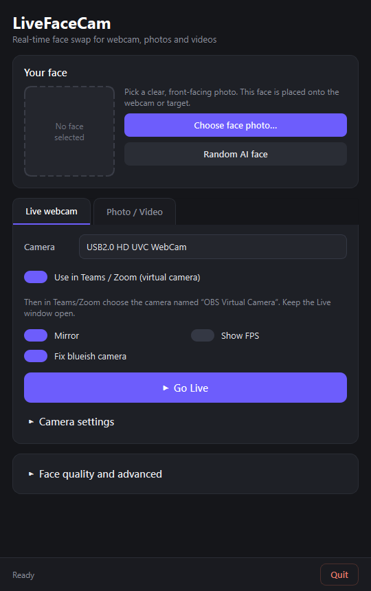

<h1 align="center">LiveFaceCam: Real-Time AI Face Swap for Webcam & Video Calls</h1>

<p align="center">
  <b>Free, open-source real-time face swap for your webcam, plus one-click photo &amp; video face swap from a single image.</b><br>
  Built-in virtual camera for video calls · clean modern UI · one-click Windows setup with NVIDIA CUDA.
</p>

<p align="center">
  <a href="https://github.com/huzaifa525/LiveFaceCam/releases/latest"></a>
  <a href="https://github.com/huzaifa525/LiveFaceCam/stargazers"></a>
  <a href="LICENSE"></a>
</p>

<p align="center">
  
</p>

**LiveFaceCam** is a free, open-source **real-time AI face swap** app. Pick one photo and it swaps that face onto your **webcam** live, or onto any **photo or video** file. A built-in **virtual camera** lets you use the result in any app that accepts a webcam, such as video-call and streaming software. It runs locally on your PC (no cloud, no account) and is accelerated on **NVIDIA GPUs with CUDA**. LiveFaceCam is a fork of [Deep-Live-Cam](https://github.com/hacksider/Deep-Live-Cam).

## ✨ What's new in LiveFaceCam

| | Deep-Live-Cam | **LiveFaceCam** |
|---|---|---|
| Virtual camera for video calls | Use OBS window capture | **Built in: one toggle** |
| Windows setup | Manual CUDA / cuDNN install | **`Setup.bat` does everything** (CUDA libs via pip) |
| Interface | Single cluttered panel | **Clean tabs: Live webcam / Photo & Video** |
| Close-up source photos | Often "no face found" | **Detected automatically** |
| Slow or busy camera | UI freezes ~40 s | **Opens in ~2 s, with a clear warning** |
| Long GPU videos | VRAM leak can crash | **Fixed** |
| AMD (DirectML) | Can crash on face analysis | **Fixed** |

<p align="center"></p>

## 🚀 Quick start (Windows)

1. **[Download the latest release](https://github.com/huzaifa525/LiveFaceCam/releases/latest)** and unzip it (or `git clone` this repo).
2. Double-click **`Setup.bat`**. It installs everything and downloads the models (first run: 5–15 minutes).
3. Double-click **`Start-LiveFaceCam.bat`**, choose a face photo, and press **▶ Go Live**.

**Requirements:** Windows 10/11, [Python 3.11–3.14](https://www.python.org/downloads/), ~6 GB disk. An NVIDIA GPU is recommended (it also runs on CPU, slowly). For Photo/Video conversion install ffmpeg: `winget install Gyan.FFmpeg`.

## 🎥 Use it as a webcam in video calls

1. Install [OBS Studio](https://obsproject.com/) once. LiveFaceCam uses its virtual-camera driver; OBS itself doesn't need to be open.
2. In LiveFaceCam, turn on **Use in Teams / Zoom (virtual camera)** and press **▶ Go Live**.
3. In your video-call app, choose the camera named **OBS Virtual Camera**.

> Keep OBS's own "Start Virtual Camera" button off; only one app can drive it at a time.

## 🧑‍🎨 Features

- **Real-time face swap** on any webcam, from a single photo
- **Photo & video face swap**: convert files and save the result
- **Virtual camera** output for video calls and streaming
- **Mouth mask**: keep your real mouth for natural lip-sync
- **Face enhancers**: GFPGAN, GPEN-256, GPEN-512
- **Swap all faces** or **map faces** to different people
- Runs **100% locally**: NVIDIA CUDA, AMD DirectML, Intel OpenVINO, Apple CoreML, or CPU


## ⚖️ Responsible use

This deepfake software is designed to be a productive tool for the AI-generated media industry. It can assist artists in animating custom characters, creating engaging content, and even using models for clothing design.

We are aware of the potential for unethical applications and are committed to preventative measures. A built-in check prevents the program from processing inappropriate media (nudity, graphic content, sensitive material like war footage, etc.). We will continue to develop this project responsibly, adhering to the law and ethics. We may shut down the project or add watermarks if legally required.

- Ethical Use: Users are expected to use this software responsibly and legally. If using a real person's face, obtain their consent and clearly label any output as a deepfake when sharing online.

- Content Restrictions: The software includes built-in checks to prevent processing inappropriate media, such as nudity, graphic content, or sensitive material.

- Legal Compliance: We adhere to all relevant laws and ethical guidelines. If legally required, we may shut down the project or add watermarks to the output.

- User Responsibility: We are not responsible for end-user actions. Users must ensure their use of the software aligns with ethical standards and legal requirements.

By using this software, you agree to these terms and commit to using it in a manner that respects the rights and dignity of others.

Users are expected to use this software responsibly and legally. If using a real person's face, obtain their consent and clearly label any output as a deepfake when sharing online. We are not responsible for end-user actions.

## Installation (Manual)

**Windows + NVIDIA users: skip this and use the [one-click setup](#-quick-start-windows) above.**

<details>
<summary>Click to see the process</summary>

### Installation

This is more likely to work on your computer but will be slower as it utilizes the CPU.

**1. Set up Your Platform**

-   Python (3.14 recommended; 3.11-3.14 supported)
-   pip
-   git
-   [ffmpeg](https://www.youtube.com/watch?v=OlNWCpFdVMA) - ```iex (irm ffmpeg.tc.ht)```
-   [Visual Studio 2022 Runtimes (Windows)](https://visualstudio.microsoft.com/visual-cpp-build-tools/)

**2. Clone the Repository**

```bash
git clone --depth 1 https://github.com/huzaifa525/LiveFaceCam.git
cd LiveFaceCam
```

**3. Download the Models**

1. [gfpgan-1024.onnx](https://huggingface.co/hacksider/deep-live-cam/resolve/main/gfpgan-1024.onnx)
2. [inswapper\_128\_fp16.onnx](https://huggingface.co/hacksider/deep-live-cam/resolve/main/inswapper_128_fp16.onnx)

Place these files in the "**models**" folder.

**4. Install Dependencies**

We highly recommend using a `venv` to avoid issues.


For Windows:
```bash
python -m venv venv
venv\Scripts\activate
pip install -r requirements.txt
```
For Linux:
```bash
# Ensure you use the installed Python 3.14
python3 -m venv venv
source venv/bin/activate
pip install -r requirements.txt
```

**For macOS:**

Apple Silicon (M1 through M5) requires specific setup:

```bash
# Install Python 3.14
brew install python@3.14

# Install tkinter package (required for the GUI)
brew install python-tk@3.14

# Create and activate virtual environment with Python 3.14
python3.14 -m venv venv
source venv/bin/activate

# Install dependencies
pip install -r requirements.txt
```

** In case something goes wrong and you need to reinstall the virtual environment **

```bash
# Deactivate the virtual environment
rm -rf venv

# Reinstall the virtual environment
python -m venv venv
source venv/bin/activate

# install the dependencies again
pip install -r requirements.txt

# gfpgan and basicsrs issue fix
pip install git+https://github.com/xinntao/BasicSR.git@master
pip uninstall gfpgan -y
pip install git+https://github.com/TencentARC/GFPGAN.git@master
```

**Run:** If you don't have a GPU, you can run LiveFaceCam using `python run.py`. Note that initial execution will download models (~300MB).

### GPU Acceleration

**CUDA Execution Provider (Nvidia)**

1. Install [CUDA Toolkit 12.8.0](https://developer.nvidia.com/cuda-12-8-0-download-archive)
2. Install [cuDNN v8.9.7 for CUDA 12.x](https://developer.nvidia.com/rdp/cudnn-archive) (required for onnxruntime-gpu):
   - Download cuDNN v8.9.7 for CUDA 12.x
   - Make sure the cuDNN bin directory is in your system PATH
3. Install dependencies:

```bash
pip install -U torch torchvision torchaudio --index-url https://download.pytorch.org/whl/cu128
pip uninstall onnxruntime onnxruntime-gpu
pip install onnxruntime-gpu==1.26.0
```

3. Usage:

```bash
python run.py --execution-provider cuda
```

**CoreML Execution Provider (Apple Silicon)**

Apple Silicon (M1 through M5) specific installation:

1. Make sure you've completed the macOS setup above using Python 3.14.
2. No extra install step is needed — `requirements.txt` pulls the official
   `onnxruntime` build, whose macOS wheels ship the CoreML execution provider.
   If you previously installed the unmaintained `onnxruntime-silicon` fork,
   remove it first, as it shadows the real package:

```bash
pip uninstall onnxruntime-silicon
pip install -r requirements.txt
```

3. Usage:

```bash
python3.14 run.py --execution-provider coreml
```

**Important Notes for macOS:**
- Python 3.11 is the minimum (onnxruntime dropped 3.10); 3.14 is recommended
- Always run with `python3.14` command not just `python` if you have multiple Python versions installed
- If you get error about `_tkinter` missing, reinstall the tkinter package: `brew reinstall python-tk@3.14`
- If you get model loading errors, check that your models are in the correct folder
- If you encounter conflicts with other Python versions, consider uninstalling them:
  ```bash
  # List all installed Python versions
  brew list | grep python

  # Uninstall conflicting versions if needed
  brew uninstall --ignore-dependencies python@3.11

  # Keep only Python 3.14
  brew cleanup
  ```

**CoreML Execution Provider (Apple Legacy)**

1. Install dependencies:

```bash
pip uninstall onnxruntime onnxruntime-coreml
pip install onnxruntime-coreml==1.21.0
```

2. Usage:

```bash
python run.py --execution-provider coreml
```

**DirectML Execution Provider (Windows)**

1. Install dependencies:

```bash
pip uninstall onnxruntime onnxruntime-directml
pip install onnxruntime-directml==1.21.0
```

2. Usage:

```bash
python run.py --execution-provider dml
```

**OpenVINO™ Execution Provider (Intel)**

1. Install dependencies:

```bash
pip uninstall onnxruntime onnxruntime-openvino
pip install onnxruntime-openvino==1.21.0
```

**Note:** `onnxruntime-openvino` newer than 1.21.0 must be installed together with `openvino`, and the two versions must correspond one-to-one. The supported pairings are:

| onnxruntime-openvino | OpenVINO |
| --- | --- |
| 1.24.1 | 2025.4.1 |
| 1.23.0 | 2025.3 |
| 1.22.0 | 2025.1 |

```bash
# Example: onnxruntime-openvino 1.24.1 pairs with OpenVINO 2025.4.1
pip install openvino==2025.4.1
pip install onnxruntime-openvino==1.24.1
```

See the [OpenVINO Execution Provider requirements](https://onnxruntime.ai/docs/execution-providers/OpenVINO-ExecutionProvider.html#requirements) for the full version-mapping details.

2. Usage:

```bash
python run.py --execution-provider openvino
```
</details>

## Usage

**Live webcam**
1. Choose a face photo (clear, front-facing).
2. Open the **Live webcam** tab, pick your camera, press **▶ Go Live**.
3. Optional: enable **Use in Teams / Zoom** to send the result to the virtual camera.

**Photo / Video**
1. Choose a face photo.
2. Open the **Photo / Video** tab and choose a target photo or video.
3. Click **Preview** to check, then **Convert & Save…**.

## Download all models in this huggingface link
- [**Download models here**](https://huggingface.co/hacksider/deep-live-cam/tree/main)

## Command Line Arguments (Unmaintained)

```
options:
  -h, --help                                               show this help message and exit
  -s SOURCE_PATH, --source SOURCE_PATH                     select a source image
  -t TARGET_PATH, --target TARGET_PATH                     select a target image or video
  -o OUTPUT_PATH, --output OUTPUT_PATH                     select output file or directory
  --frame-processor FRAME_PROCESSOR [FRAME_PROCESSOR ...]  frame processors (choices: face_swapper, face_enhancer, ...)
  --keep-fps                                               keep original fps
  --keep-audio                                             keep original audio
  --keep-frames                                            keep temporary frames
  --many-faces                                             process every face
  --map-faces                                              map source target faces
  --mouth-mask                                             mask the mouth region
  --video-encoder {libx264,libx265,libvpx-vp9}             adjust output video encoder
  --video-quality [0-51]                                   adjust output video quality
  --live-mirror                                            the live camera display as you see it in the front-facing camera frame
  --live-resizable                                         the live camera frame is resizable
  --max-memory MAX_MEMORY                                  maximum amount of RAM in GB
  --execution-provider {cpu} [{cpu} ...]                   available execution provider (choices: cpu, ...)
  --execution-threads EXECUTION_THREADS                    number of execution threads
  -v, --version                                            show program's version number and exit
```

Looking for a CLI mode? Using the -s/--source argument will make the run program in cli mode.

## Credits

-   **LiveFaceCam is a fork of [Deep-Live-Cam](https://github.com/hacksider/Deep-Live-Cam) by [hacksider](https://github.com/hacksider) and contributors.** All core face-swap technology comes from that project.

-   [ffmpeg](https://ffmpeg.org/): for making video-related operations easy
-   [Henry](https://github.com/henryruhs): One of the major contributor in this repo
-   [deepinsight](https://github.com/deepinsight): for their [insightface](https://github.com/deepinsight/insightface) project which provided a well-made library and models. Please be reminded that the [use of the model is for non-commercial research purposes only](https://github.com/deepinsight/insightface?tab=readme-ov-file#license).
-   [havok2-htwo](https://github.com/havok2-htwo): for sharing the code for webcam
-   [GosuDRM](https://github.com/GosuDRM): for the open version of roop
-   [pereiraroland26](https://github.com/pereiraroland26): Multiple faces support
-   [vic4key](https://github.com/vic4key): For supporting/contributing to this project
-   [kier007](https://github.com/kier007): for improving the user experience
-   [qitianai](https://github.com/qitianai): for multi-lingual support
-   [laurigates](https://github.com/laurigates): Decoupling stuffs to make everything faster!
-   [maxwbuckley](https://github.com/maxwbuckley): For making the effort to optimize this for mac!
-   and [all developers](https://github.com/hacksider/Deep-Live-Cam/graphs/contributors) behind libraries used in this project.
-   Footnote: Please be informed that the base author of the code is [s0md3v](https://github.com/s0md3v/roop)
-   All the wonderful users who helped make this project go viral by starring the repo ❤️

## License

LiveFaceCam is licensed under **AGPL-3.0**, like the original project. The face-swap model (insightface `inswapper_128`) is licensed for **non-commercial research use only**, so LiveFaceCam is and will remain a free, non-commercial tool.

## Star history

<a href="https://star-history.com/#huzaifa525/LiveFaceCam&Date">
 <picture>
   <source media="(prefers-color-scheme: dark)" srcset="https://api.star-history.com/svg?repos=huzaifa525/LiveFaceCam&type=Date&theme=dark" />
   
 </picture>
</a>
